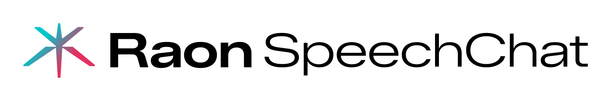

# Raon SpeechChat Demo

<div align="center">
  <picture>
    <source media="(prefers-color-scheme: dark)" srcset="assets/Raon-Speechchat-Gradient-White.png">
    <source media="(prefers-color-scheme: light)" srcset="assets/Raon-Speechchat-Gradient-Black.png">
    
  </picture>
</div>

A real-time, full-duplex speech conversation demo built on the
[Raon-Speech](https://github.com/krafton-ai/Raon-Speech) duplex model.

Talk to the model through your browser — it listens and responds with voice
simultaneously, just like a natural conversation.

## Features

- **Full-duplex streaming** — simultaneous speech input and output
- **Browser-based UI** — no app install required; works over WebSocket
- **Configurable personas** — choose from 17 preset personas or write your own
- **Speaker voice conditioning** — supply a reference WAV to control output voice
- **Conversation export** — download transcripts and audio as a ZIP
- **Multi-GPU support** — Ray-based worker pool for concurrent sessions

## Prerequisites

- NVIDIA GPU with CUDA 12.x (16 GB+ VRAM recommended)
- Docker and [NVIDIA Container Toolkit](https://docs.nvidia.com/datacenter/cloud-native/container-toolkit/install-guide.html)
- Node.js 18+ (for building the frontend)

## Quick Start

The model is downloaded and converted automatically on first run.

```bash
# 1. Clone the repo
git clone https://github.com/krafton-ai/Raon-SpeechChat-Demo.git
cd Raon-SpeechChat-Demo

# 2. Build the frontend static bundle
cd frontend-next
npm install
npm run export        # produces out/ consumed by the gateway
cd ..

# 3. Build and start (model auto-downloads on first run)
docker compose up -d --build
```

After the service starts, visit `https://localhost:8082/fd-demo/`. The self-signed certificate will trigger a browser warning — click "Advanced" → "Proceed" to continue.

On first run, the worker automatically:
1. Downloads `KRAFTON/Raon-SpeechChat-9B` from HuggingFace (~25 GB)
2. Exports it to SGLang bundle format
3. Caches the result in a Docker volume (subsequent runs skip this)
4. Loads the model and starts serving

This takes ~15-30 minutes on first run. Check readiness with:

```bash
curl -k https://localhost:8082/health
# Look for: "status": "ok", "healthy_worker_count" > 0
# (-k skips self-signed cert verification)
```

**Advanced usage:**

```bash
# Use a specific HuggingFace model
HF_MODEL_ID=KRAFTON/Raon-SpeechChat-9B docker compose up -d --build

# Use a pre-downloaded SGLang bundle (skips download entirely)
MODEL_PATH=/path/to/your/sglang-bundle docker compose up -d --build
```

## Configuration

Copy `.env.example` to `.env` and edit as needed. Key variables:

| Variable | Required | Default | Description |
|----------|----------|---------|-------------|
| `MODEL_PATH` | No | (auto-download) | Path to pre-downloaded SGLang bundle; if empty, model is downloaded automatically |
| `HF_MODEL_ID` | No | `KRAFTON/Raon-SpeechChat-9B` | HuggingFace model ID for auto-download |
| `HF_TOKEN` | No | — | HuggingFace token (for gated models) |
| `FD_GPU_IDS` | No | `0` | Comma-separated GPU IDs for worker actors |
| `FD_MAX_SESSIONS_PER_GPU` | No | `2` | Max concurrent sessions per GPU |
| `FD_ENABLE_COMPILE_AUDIO_MODULES` | No | `1` | Enable torch.compile for audio modules |
| `DEFAULT_SPEAKER_AUDIO_PATH` | No | `data/raon.wav` | Reference speaker WAV (resampled to 24 kHz at load time) |
| `SPEECHBRAIN_ECAPA_SAVEDIR` | No | `/tmp/speechbrain_ecapa_cache` | SpeechBrain ECAPA model cache dir |

### GPU selection

By default, Docker exposes **all** available GPUs to the worker container
(`count: all` in `docker-compose.yml`). The `FD_GPU_IDS` environment variable
controls which of those visible GPUs receive worker actors.

```bash
# Example: use GPUs 0 and 1
FD_GPU_IDS=0,1 docker compose up -d --build --force-recreate
```

## Architecture

Two long-running Docker services:

```
Browser
  |
  |  WebSocket (binary frames)
  v
fd-gateway  (FastAPI + Uvicorn, CPU)
  |
  |  Ray client protocol
  v
fd-worker   (Ray head, GPU workers)
  ├── fd_router    — session placement and health monitoring
  ├── worker-gpu0  — RaonEngine + model on GPU 0
  └── worker-gpu1  — RaonEngine + model on GPU 1
```

**Session lifecycle:**

1. Browser opens `wss://.../ws/chat?prompt=...&temperature=0.7`
2. Gateway reserves a worker through the Ray router
3. Worker creates a session and pre-allocates decode state
4. Gateway sends `READY`; browser starts streaming audio
5. Gateway batches audio frames and calls `feed_and_decode()` on the worker
6. Worker returns `TEXT` and `AUDIO` frames; gateway relays to browser
7. Either side sends `CLOSE` to end the session

### Key modules

| Module | Role |
|--------|------|
| `gateway/server.py` | HTTP + WebSocket endpoints, static frontend serving |
| `gateway/proxy.py` | Per-session relay, audio batching, backlog control |
| `router/` | Cluster-wide worker registry and session placement |
| `worker/actor.py` | Ray actor wrapping one GPU engine |
| `worker/engine.py` | Model loading, session management, speaker embeddings |
| `worker/session.py` | Per-session prompt init, decode step, text extraction |
| `raon_runtime/` | Model inference engine (Voxtral + Mimi + ECAPA) |
| `proto/` | Wire protocol, configs, prompt templates |

## WebSocket Protocol

Binary frame format: `[1 byte kind][payload bytes]`

| Kind | Hex | Direction | Payload |
|------|-----|-----------|---------|
| READY | `0x00` | server | (empty) |
| AUDIO | `0x01` | both | float32 LE PCM @ 24 kHz |
| TEXT | `0x02` | server | UTF-8 text delta |
| SEQ_TRACE | `0x03` | server | full sequence trace |
| SEQ_DELTA | `0x04` | server | incremental trace delta |
| ERROR | `0x05` | server | UTF-8 error message |
| CLOSE | `0x06` | both | (empty) |
| PING | `0x07` | both | (empty) |
| PONG | `0x08` | both | (empty) |

Audio framing: 24 kHz sample rate, 1920 samples per frame (80 ms).

## Frontend Development

```bash
cd frontend-next
npm install
npm run dev          # dev server with hot reload
npm run export       # build static bundle for production
```

The gateway serves the static export from `frontend-next/out/`.
Rebuild the export after editing frontend source.

### WebSocket query parameters

The frontend connects with configurable parameters:

`prompt`, `prompt_language`, `temperature`, `top_k`, `top_p`,
`eos_penalty`, `bc_penalty`, `repetition_penalty`,
`system_prompt_style`, `system_prompt_persona`, `system_prompt_context`,
`custom_system_prompt`, `speaker_mode`, `speaker_key`

## Runtime Specialization

This demo is specialized for a specific model family:

- **Audio input encoder:** Voxtral realtime encoder
- **Audio output tokenizer / decoder:** Mimi
- **Speaker encoder:** SpeechBrain ECAPA-TDNN

If your checkpoint uses a different architecture, you may need to modify
`raon_runtime/model.py` and the warmup path in `worker/engine.py`.

## Troubleshooting

**"no workers available"** — Worker is still loading. Check:
```bash
docker logs -f fd-demo-fd-worker-1
```
Wait for `First worker on GPU X ready` in the logs.

**Worker stuck in "starting"** — Model load + compile warmup takes several
minutes on first start. This is expected.

**WebSocket connects but no audio** — Check that the browser has microphone
permission. The gateway serves HTTPS by default (self-signed cert).
If you see a browser security warning, accept it to proceed.

**Wrong GPUs used** — Docker visibility (`device_ids`) and runtime selection
(`FD_GPU_IDS`) are separate. Both must include the target GPUs.

## Repository Layout

```
Raon-SpeechChat-Demo/
├── docker-compose.yml
├── Dockerfile.worker          # GPU worker image
├── Dockerfile.gateway         # CPU gateway image
├── launch_worker.py           # Worker entry point (Ray head)
├── launch_gateway.py          # Gateway entry point
├── requirements.txt
├── requirements.gateway.txt
├── .env.example               # Documented environment variables
├── data/
│   └── raon.wav               # Default speaker reference audio (see data/README.md)
├── frontend-next/
│   ├── src/                   # Next.js source
│   ├── out/                   # Static export (build artifact)
│   └── package.json
├── proto/                     # Wire protocol and config types
├── gateway/                   # WebSocket gateway
├── router/                    # Session placement and health
├── worker/                    # GPU worker and inference engine
└── raon_runtime/              # Core model runtime
```

## License

This project is licensed under the Apache License 2.0 — see [LICENSE](LICENSE) for details.

The [Raon-SpeechChat-9B](https://huggingface.co/KRAFTON/Raon-SpeechChat-9B) model
weights are distributed under their own license on HuggingFace — refer to the
model card for terms and conditions.

### Third-party acknowledgments

- [SpeechBrain](https://github.com/speechbrain/speechbrain) (Apache 2.0) — ECAPA-TDNN speaker encoder
- [Raon-Speech](https://github.com/krafton-ai/Raon-Speech) — core model runtime and export utilities
- [SGLang](https://github.com/sgl-project/sglang) (Apache 2.0) — model serving backend
